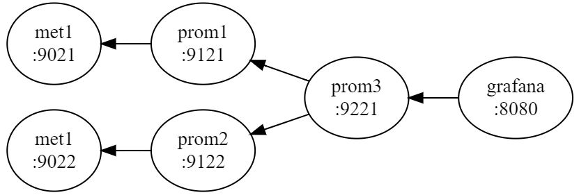

# prometheus-tenancy-forwarding
Example of simple tenancy and forwarding/federation with prometheus

# Structure

* met1 is a metrics endpoint for tenant "met1"
* met2 is a metrics endpoint for tenant "met2"
* prom1 is the "met1" tenant instance. This is responsible for local scraping and applying the "met1" label to series.
* prom2 is the "met2" tenant instance. This is responsible for local scraping and applying the "met2" label to series.
* prom3 is the federated central instance. This is responsible for aggregating all tenant metrics.

# Set up

1. Install prometheus 2.0 branch latest version in /opt/prometheus/
2. Create a python virtual environment: `python3 -m venv venv`
3. Enter the virtual environment `source venv/bin/activate`
4. Install required packages `python3 -m pip install prometheus_client`
5. Run met1 tenant `./met.py 1 &`. `curl http://localhost:9021/metrics` to check.
6. Run met2 tenant `./met.py 2 &`. `curl http://localhost:9022/metrics` to check.
7. Run prom1 prometheus `./prom1 &`. `curl http://localhost:9121` to check.
8. Run prom2 prometheus `./prom2 &`. `curl http://localhost:9122` to check.
9. Run prom3 prometheus `./prom3 &`. `curl http://localhost:9221` to check.

At this point, prom3 is federating prom1/prom2 data which is labeled with the tenant.

Open http://localhost:9221 in the browser to look at federated metrics (or point grafana at it)